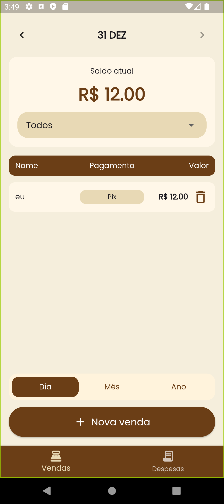

# 🍰 Sabor de Casa

**Sabor de Casa** é um aplicativo mobile desenvolvido em **Flutter** focado no controle financeiro simples e eficiente para pequenos negócios caseiros. Gerencie suas vendas, despesas e acompanhe seus resultados com facilidade.



---

## ✨ Funcionalidades

- 💰 **Controle de Vendas**: Registre todas as entradas de forma rápida.
- 📉 **Gestão de Despesas**: Acompanhe seus custos para saber seu lucro real.
- 📊 **Dashboard Visual**: Gráficos interativos para análise de desempenho (usando `fl_chart`).
- 📅 **Filtros Avançados**: Visualize dados por dia, mês e ano.
- 💾 **Persistência de Dados**: Armazenamento local robusto com **SQLite** (funciona offline).
- 🎨 **Interface Amigável**: Design limpo e intuitivo com tipografia moderna (Google Fonts).

---

## 🛠️ Tecnologias Utilizadas

Este projeto utiliza as melhores práticas e pacotes do ecossistema Flutter:

- **[Flutter](https://flutter.dev/)** & **[Dart](https://dart.dev/)**
- **[sqflite](https://pub.dev/packages/sqflite)**: Banco de dados local SQL.
- **[fl_chart](https://pub.dev/packages/fl_chart)**: Criação de gráficos financeiros.
- **[google_fonts](https://pub.dev/packages/google_fonts)**: Tipografia personalizada (Poppins).
- **Material Design 3**: Estilização moderna e consistente.

---

## 📂 Estrutura do Projeto

A organização do código fonte em `lib/` segue uma estrutura modular:

```
lib/
├── database/      # Camada de persistência (SQLite)
├── models/        # Modelos de dados (Venda, Despesa)
├── pages/         # Telas principais (Vendas, Despesas)
├── theme/         # Configurações de tema e cores
├── widgets/       # Componentes reutilizáveis e gráficos
└── main.dart      # Ponto de entrada e configuração de rotas
```

---

## 🚀 Como Rodar o Projeto

Pré-requisitos: Tenha o [Flutter SDK](https://docs.flutter.dev/get-started/install) instalado.

1. **Clone o repositório**
   ```bash
   git clone https://github.com/keniareis/app-BakeryFlow.git
   cd app-BakeryFlow
   ```

2. **Instale as dependências**
   ```bash
   flutter pub get
   ```

3. **Execute o aplicativo**
   ```bash
   flutter run
   ```

---

## 📄 Licença

Este projeto é destinado a fins de estudo e portfólio.
